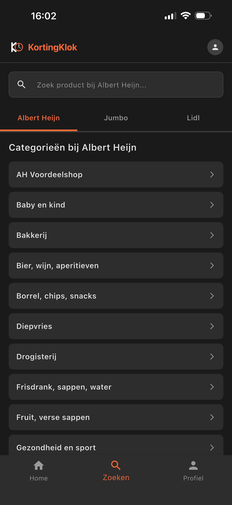
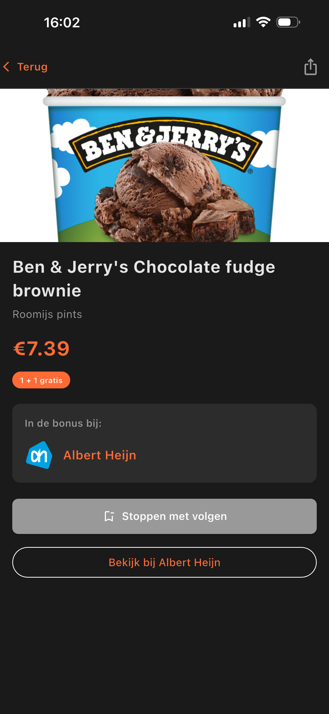
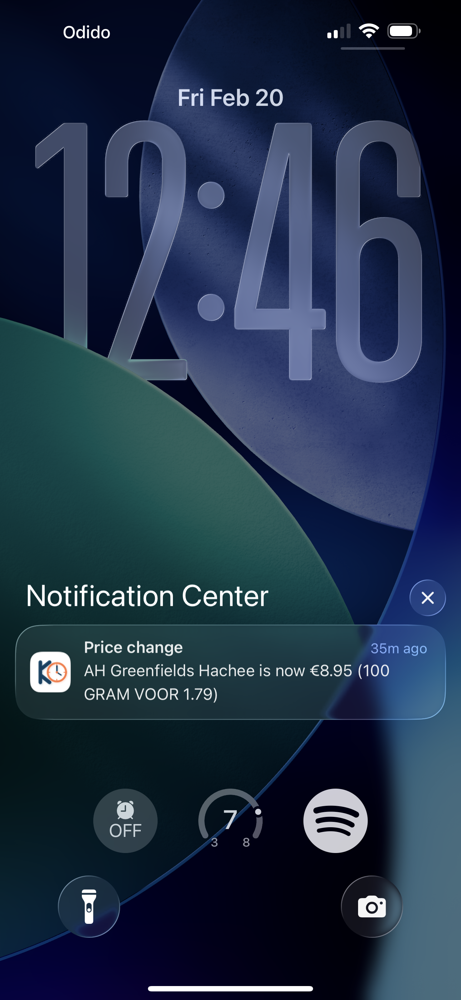

# KortingKlok

KortingKlok tracks prices and discounts across Dutch supermarkets (Albert Heijn, Jumbo, Lidl) and notifies you when a product you follow changes price.

## How it works

| Browse today's deals | Search by store | Follow a product | Get notified |
| --- | --- | --- | --- |
|  |  |  |  |

1. **Browse today's deals** — the home screen shows current discounts across all supermarkets, filterable per store.
2. **Search by store** — browse products by category for Albert Heijn, Jumbo, or Lidl.
3. **Follow a product** — open a product to see its price and bonus offers, then follow it to track changes.
4. **Get notified** — when a followed product's price changes, KortingKlok sends you a push notification.

## Setup

After cloning, run the following to activate the pre-commit hooks:

```bash
git config core.hooksPath .githooks
```
