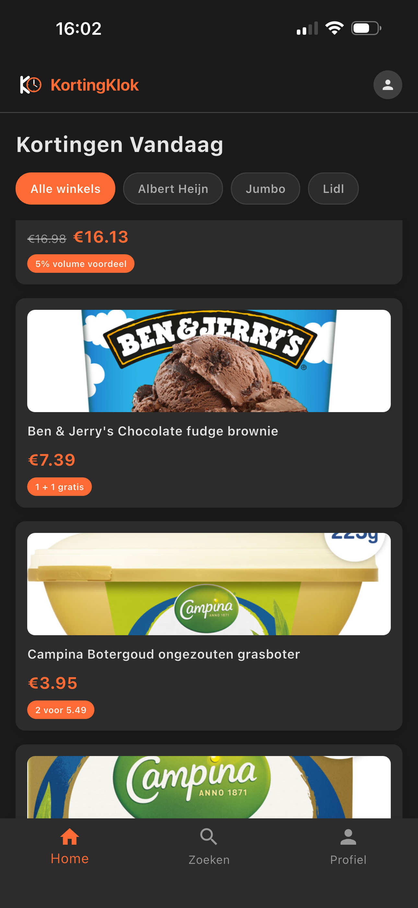

# KortingKlok

**Never miss a discount at your supermarket again.**

KortingKlok tracks prices across Albert Heijn, Jumbo, and Lidl, and sends you a
push notification the moment a product you follow changes price. Open source,
self-hostable, and free of ads, trackers, and affiliate links.

[](https://github.com/RashadAnsari/KortingKlok/actions/workflows/backend.yml)
[](https://github.com/RashadAnsari/KortingKlok/actions/workflows/mobile.yml)
[](LICENSE)

| Browse today's deals | Search by store | Follow a product | Get notified |
| --- | --- | --- | --- |
|  |  |  |  |

## Why it exists

Dutch supermarket discounts rotate weekly, they are spread across three
different apps, and the one week your favourite coffee is in the bonus is the
week you did not check. KortingKlok watches for you: it takes a full snapshot of
every store's catalogue on a schedule, compares it to the previous one, and
tells you what changed on the products you actually care about.

## Features

- **Every deal in one place.** Current discounts across all supported stores on
  one screen, filterable per supermarket.
- **Search the full catalogue.** Tens of thousands of products, browsable by
  store and category.
- **Follow what matters.** Track individual products instead of wading through
  a weekly folder.
- **Price-change push notifications.** Delivered through Firebase Cloud
  Messaging when a tracked product moves.
- **Price history in the database.** Every change is stored against the scrape
  run that found it, so the data to tell a real discount from a reset base price
  is already there.
- **Dutch and English**, light and dark.
- **Yours to run.** No hosted service to depend on, no telemetry you did not
  configure yourself.

## How it works

```
  Albert Heijn ─┐
  Jumbo ────────┼─▶ Scrapers ──▶ Snapshot diff ──▶ Postgres ──▶ REST API ──▶ Flutter app
  Lidl ─────────┘   (Celery)     price changes                                    ▲
                                      │                                           │
                                      └──▶ Firebase Cloud Messaging ──────────────┘
```

1. `scrape_all_supermarkets` dispatches one Celery task per supermarket. Each
   scraper returns a complete snapshot of that store's categories and products.
2. The snapshot is diffed against the database: new products are created,
   missing ones are marked unavailable, and every price change is written to a
   price-history row tagged with the run.
3. Changed products are matched against what users follow, and a notification
   goes out in the user's own language.
4. The app reads it all over a versioned REST API, authenticated with Firebase
   ID tokens.

Each supermarket needs a different approach, and all three are documented in
the code: Albert Heijn has a mobile API with taxonomy-based pagination, Jumbo's
data is parsed out of the server-rendered Nuxt payload, and Lidl is read from
the JSON embedded in its product grid markup.

## Tech stack

| | |
| --- | --- |
| **Backend** | Django 4, Django REST Framework, Celery, Postgres, Redis |
| **App** | Flutter, Firebase Auth, Firebase Cloud Messaging |
| **Tooling** | Poetry, ruff, pytest, GitHub Actions |

## Quick start

```bash
git clone https://github.com/RashadAnsari/KortingKlok.git
cd KortingKlok
git config core.hooksPath .githooks
```

**Backend**: Postgres and Redis in Docker, API on `localhost:8000`:

```bash
cd backend
python -m venv .venv && source .venv/bin/activate
pip install --upgrade pip && pip install poetry==1.8.5
poetry config virtualenvs.create false && poetry install
cp .env.example .env
make up && make db-migrate
make runserver          # and, in another terminal, make runworker
```

**App**: pointed at that backend:

```bash
cd mobile
make firebase           # configure your own Firebase project
flutter pub get
flutter run --dart-define=API_HOST=http://localhost:8000
```

Full instructions, including Firebase and release builds, are in
[backend/README.md](backend/README.md) and [mobile/README.md](mobile/README.md).

## Repository layout

```
backend/    Django REST API, Celery workers, supermarket scrapers
mobile/     Flutter app for iOS and Android
docs/       screenshots
```

## Adding a supermarket

Scrapers implement one small interface and register themselves with a
decorator. Everything downstream, persistence, price-change detection, and
notifications, comes for free. The walkthrough is in
[CONTRIBUTING.md](CONTRIBUTING.md#adding-a-supermarket).

## Contributing

Bug reports, scraper fixes, and new stores are all welcome. Start with
[CONTRIBUTING.md](CONTRIBUTING.md), and note that participation is covered by
the [Code of Conduct](CODE_OF_CONDUCT.md). Security issues go through
[SECURITY.md](SECURITY.md) rather than the issue tracker.

## Disclaimer

KortingKlok is an independent project and is not affiliated with, endorsed by,
or connected to Albert Heijn, Jumbo, Lidl, or any other retailer. Product names
and logos belong to their respective owners. Scraped data comes from publicly
accessible pages and may be incomplete or out of date, so always check the price
in store. If you run your own instance, keep request rates modest and respect
each site's terms of use.

## License

[MIT](LICENSE)
